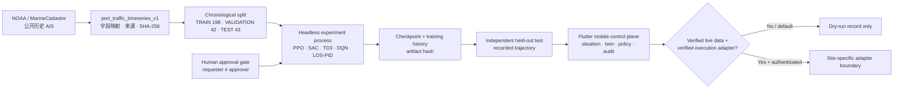

<div align="center">
  

# PortAI DT Mobile

**面向港口交通研究的移动数字孪生与策略实验控制面**<br>
**An evidence-aware mobile digital twin and policy experimentation control plane for port-traffic research**

[](https://github.com/wenjiayi123/dt-mobile-app/actions/workflows/ci.yml)
[](LICENSE)


[中文](#中文) · [English](#english) · [实验方法](docs/RL_METHODOLOGY.md) · [数据契约](docs/DATASET_CONTRACT.md) · [安全策略](SECURITY.md)
</div>

---

## 中文

PortAI DT Mobile 不是一组静态大屏，也不是把预制曲线包装成“智能决策”。它把 Flutter 移动交互、FastAPI 实验控制面、公开 AIS 时间序列、无渲染策略训练、独立留出测试、证据回放与人机审批组织成一条可追溯的研究链路。

仓库当前默认运行于 `public_replay`：内置样本由 NOAA / MarineCadastre 公开历史 AIS 聚合而来，环境动作响应是已声明的沙箱假设，生产下发默认关闭。界面中的轨迹来自训练完成后的测试进程，不是训练时渲染，也不被表述为真实港口控制效果。

### 为什么它不只是一个移动端 Demo

| 层级 | 已实现能力 | 可核验证据 |
|---|---|---|
| 移动数字孪生 | 态势、三维孪生、设备、风险、调度、策略、告警、审计的联动导航 | Flutter 页面、状态控制器与 17 项客户端测试 |
| 数据治理 | 版本化字段契约、来源登记、SHA-256、时间范围、身份字段移除声明 | manifest、转换脚本、数据状态 API |
| 策略实验 | PPO、SAC、TD3、DQN 与 LOS-PID 五条真实训练/校准接线 | Stable-Baselines3、原生 LOS-PID、五基线冒烟门禁 |
| 评估隔离 | 70/15/15 顺序切分；归一化器只拟合训练集；测试在训练进程退出后开始 | `198 / 42 / 43` 时间段、模型与历史哈希 |
| 证据呈现 | 只有完成测试产物才允许播放；轨迹携带数据、环境、模型和运行标识 | `portai_policy_test_rollout_v1` 契约 |
| 人机治理 | 移动端申请、电脑端异人审批、并发限制、审计前向链、执行门禁 | 审批 API、策略门禁页、JSONL SHA-256 链 |
| 失效安全 | 无验证实时源、无验证执行适配器或无认证时拒绝生产下发 | `production_dispatch_enabled=false` 默认值与健康状态 |

### 系统链路



关键边界：`TRAIN render_mode=None → 模型与历史哈希 → 训练进程结束 → held-out TEST → 记录轨迹 → 客户端回放`。

### 真实界面

<table>
  <tr>
    <td width="58%"></td>
    <td width="42%"></td>
  </tr>
  <tr>
    <td><b>移动运营控制面</b><br/>历史 AIS 证据标签、态势入口、小懿决策联动、告警与审计状态。</td>
    <td><b>独立实验审批门禁</b><br/>数据证据、五基线合同、时间切分、执行权与待审批实验同屏复核。</td>
  </tr>
</table>

### 五基线策略实验

| 基线 | 实现 | 动作空间 | 在仓库中的角色 |
|---|---|---|---|
| PPO | Stable-Baselines3 | 连续 | on-policy 策略梯度基线 |
| SAC | Stable-Baselines3 | 连续 | 最大熵 off-policy 基线 |
| TD3 | Stable-Baselines3 | 连续 | 双延迟确定性策略基线 |
| DQN | Stable-Baselines3 | 离散 | 离散策略对照基线 |
| LOS-PID | 原生 Python | 连续 | 非学习型控制理论基线与可解释对照 |

短步数 `smoke` 只验证数据、训练、测试和产物接线，不证明收敛、优越性或现场适用性。正式比较必须固定数据哈希、环境版本、种子、预算和评价口径，并保留完整产物。

### 数据与可替换港口契约

仓库自带样本覆盖 2024-01-10 的长滩港邻近范围，原始归档扫描 7,024,515 行，边界框内 110,955 行；去除 MMSI 后聚合为 283 个五分钟时间片，并按时间顺序切为 198 个训练、42 个验证和 43 个测试时间片。来源、边界框、原始文件哈希和使用限制均在 manifest 中保留。

接入另一个港口不需要重写算法层：

1. 将源数据映射到 [`port_traffic_timeseries_v1`](docs/DATASET_CONTRACT.md)。
2. 新建 manifest，记录字段映射、来源、数据 SHA-256、证据等级和沙箱响应参数。
3. 设置 `PORTAI_DATASET_MANIFEST=/absolute/path/to/manifest.json`。
4. 通过 `/api/data/status` 核对哈希、范围和时间切分。
5. 数据、环境或奖励合同变化后重新训练；旧模型会被拒绝测试。

[`scripts/import_noaa_ais.py`](scripts/import_noaa_ais.py) 是公开 AIS 转换参考。TOS、ECS、VTS 或现场遥测仍需港口专属适配、标定和独立验收，不能靠字段改名获得生产可信度。

### 快速开始

要求：Flutter `3.38.x` / Dart `3.10.x`，Python `3.12–3.14`。建议使用隔离环境。

```bash
git clone https://github.com/wenjiayi123/dt-mobile-app.git
cd dt-mobile-app
cp .env.example .env
./scripts/run_backend.sh
```

另开终端启动 Flutter：

```bash
flutter pub get
flutter run -d chrome \
  --dart-define=API_BASE_URL=http://127.0.0.1:8000 \
  --dart-define=APP_ENV=public_replay
```

在“策略”页选择基线和实验预算，提交申请；电脑端打开 `http://127.0.0.1:8000/rl-panel`，由不同操作者批准后才创建本地实验进程。

Docker 方式：

```bash
docker compose up --build
```

### 验证门禁

```bash
# Flutter：格式、静态分析与测试
bash scripts/check.sh

# Python：编译与 API / 训练合同测试
bash scripts/check_backend.sh

# 五基线 128 步接线验证；smoke_only=true
python scripts/smoke_all_baselines.py --timesteps 128

# 上述门禁 + 数据边界与禁用伪造指标检查
bash scripts/release_check.sh
```

当前本地基线：Flutter 17 tests，Python 19 tests；PPO / SAC / TD3 / DQN / LOS-PID 五条 128-step smoke 均能完成 train → test → artifact 链路。

### 生产门禁与安全边界

默认 `production_dispatch_enabled=false`。生产适配至少要求：

- `PORTAI_DATA_MODE=live` 与经过验证的实时数据网关；
- `PORTAI_LIVE_DATA_VERIFIED=true`；
- `PORTAI_EXECUTION_ADAPTER_VERIFIED=true` 与专属执行适配器；
- 32 字符以上 API 密钥、严格 CORS、站点联锁、最小权限凭证与独立验收。

任一条件缺失都只写入 dry-run 审计，不会下发现场动作。本仓库不是经认证的船舶导航、避碰、VTS、监管执法或自动驾驶系统，不应直接用于真实船舶决策。

### 仓库结构

```text
lib/                         Flutter 移动控制面、状态与数据源
backend/portai_rl/           FastAPI 控制面、数据合同、环境与训练器
backend/config/              可审计数据 manifest
backend/data/                去标识化公开 AIS 聚合样本
scripts/                     启动、导入、测试与发布门禁
test/                        Flutter 合同和界面测试
backend/tests/               API、隔离、哈希和安全边界测试
docs/                        方法、数据、接口、演示和安全文档
```

---

## English

PortAI DT Mobile is an evidence-aware research stack that connects a Flutter mobile control plane to a FastAPI experiment service, versioned public-AIS data, headless policy training, process-separated held-out evaluation, recorded trajectory replay, and human approval.

It is deliberately not presented as a production port controller. The default dataset is an aggregated historical replay derived from public NOAA / MarineCadastre AIS. Environment action responses are declared sandbox assumptions, and production dispatch fails closed unless independently verified live-data and execution-adapter gates are both enabled.

### What is implemented

- **Linked operational surfaces:** situation, 3D twin, equipment, risk, scheduling, policy, alerts, evidence replay, audit, and Xiaoyi-assisted navigation share application state rather than existing as isolated mock screens.
- **Governed data contract:** source locator, bounding box, time range, de-identification statement, field mapping, schema version, and SHA-256 are carried in the dataset manifest.
- **Five-baseline experiment contract:** PPO, SAC, TD3, DQN, and a native LOS-PID control baseline use real executable training or calibration paths.
- **Evaluation isolation:** chronological 70/15/15 splits, train-only normalization, a process boundary after training, and test-only recorded trajectories prevent the client from presenting training animation as evaluation evidence.
- **Artifact lineage:** policy, training history, dataset, environment, and rollout identifiers are retained for replay and review.
- **Human-gated execution:** mobile requests do not start a job until a different desktop operator approves them. Request size, identifiers, concurrency, parameters, credentials, and production gates are bounded or validated.
- **Tamper-evident audit:** server-side JSONL records use a SHA-256 forward chain. This provides tamper evidence, not an external timestamp or immutable ledger.

### Reproducible research sequence

```text
public AIS archive
  → transformation manifest + SHA-256
  → chronological TRAIN / VALIDATION / TEST split
  → headless training or LOS-PID calibration
  → checkpoint + history hashes
  → separate held-out test
  → recorded trajectory artifact
  → evidence-labelled Flutter replay
```

The bundled example contains 283 five-minute intervals split into 198 train, 42 validation, and 43 held-out test rows. Validation is preserved as a separate temporal segment; it is not silently merged into training. See [RL methodology](docs/RL_METHODOLOGY.md) for the exact contract and limitations.

### Run, test, and extend

Use the commands in [Quick start](#快速开始), then consult:

- [Dataset contract](docs/DATASET_CONTRACT.md) for port substitution;
- [Backend contract](docs/BACKEND_CONTRACT.md) for API and WebSocket semantics;
- [RL methodology](docs/RL_METHODOLOGY.md) for train/test separation;
- [Data sources](docs/DATA_SOURCES.md) for provenance and permitted interpretation;
- [Testing](docs/TESTING.md) for verification scope;
- [Security policy](SECURITY.md) for deployment gates and reporting;
- [Contributing](CONTRIBUTING.md) and [governance](GOVERNANCE.md) for project workflow.

### Scope statement

This repository is a research, teaching, and software-verification project. It does not claim policy convergence, superiority over established control, real-time telemetry coverage, production dispatch authority, regulatory suitability, or navigational certification. Any deployment involving real port or vessel operations requires site-specific data agreements, calibration, safety engineering, authenticated adapters, interlocks, independent acceptance, and accountable human authority.

## License and data terms

Code is released under the [MIT License](LICENSE). Dataset provenance and limitations are documented separately in [docs/DATA_SOURCES.md](docs/DATA_SOURCES.md); the software license does not override source-data terms or grant operational approval.

If you use the architecture or experiment contract in academic work, see [`CITATION.cff`](CITATION.cff).
