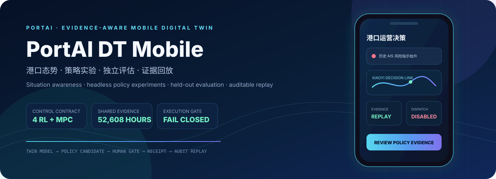
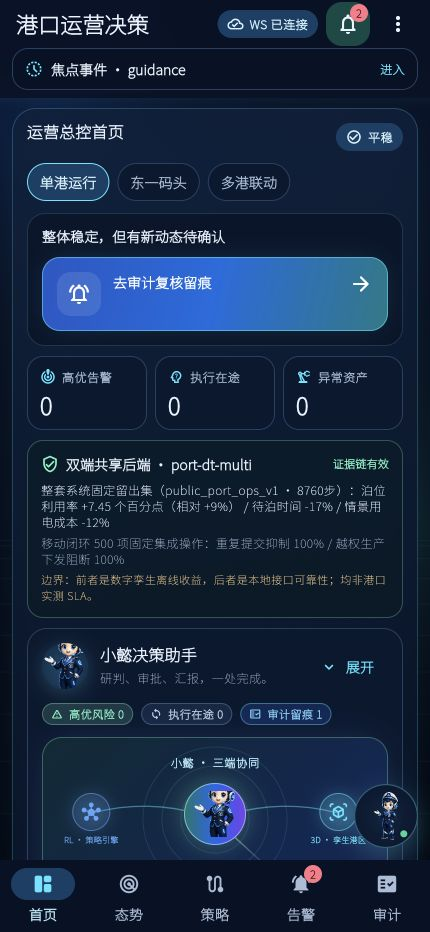
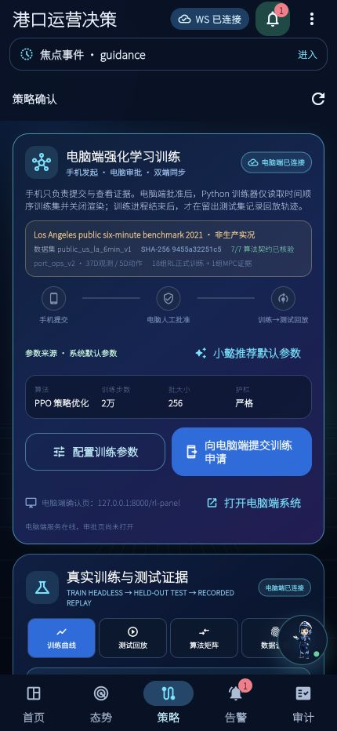
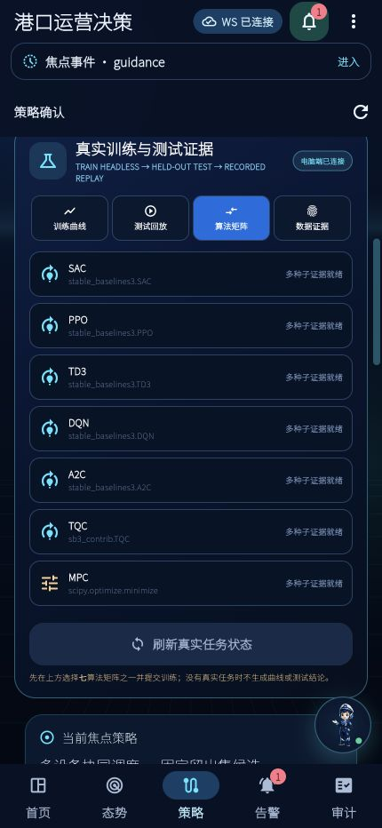
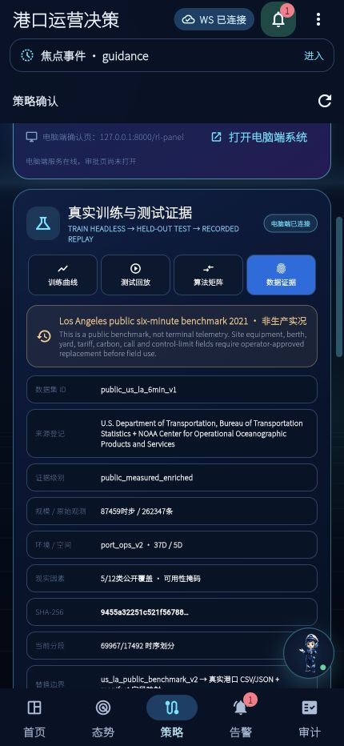
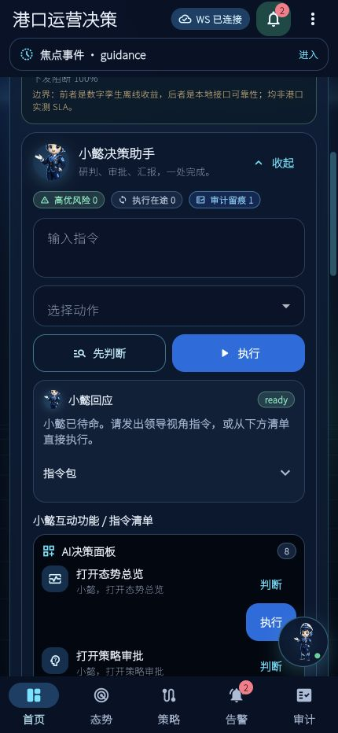

<div align="center">
  

# PortAI DT Mobile

<strong>数字孪生 AI 港口智能决策系统的 Flutter 移动前台</strong><br>
<strong>The Flutter operations and human-decision frontend of the dual-frontend port digital twin</strong>

<strong>研发作者：</strong>温家懿 · <strong>Research Author:</strong> Wen Jiayi

[](https://github.com/wenjiayi123/dt-mobile-app/actions/workflows/ci.yml)
[](LICENSE)


[双语说明 / Bilingual guide](#双语说明--bilingual-guide) · [共享后端契约 / Shared backend](docs/SHARED_BACKEND_CONTRACT.md) · [双端简历证据 / Evidence](docs/RESUME_CLAIMS_DUAL_FRONTEND.md) · [安全策略 / Security](SECURITY.md)
</div>

<table>
  <tr>
    <th align="center">固定闭环操作<br /><sub>FIXED WORKFLOW OPS</sub></th>
    <th align="center">幂等与越权阻断<br /><sub>FAIL-CLOSED GATES</sub></th>
    <th align="center">审计事件<br /><sub>AUDIT CHAIN</sub></th>
    <th align="center">唯一服务端回执<br /><sub>UNIQUE RECEIPTS</sub></th>
    <th align="center">发布测试<br /><sub>RELEASE TESTS</sub></th>
  </tr>
  <tr>
    <td align="center"><strong>500</strong><br />固定API操作 / fixed API operations</td>
    <td align="center"><strong>100%</strong><br />重复/冲突/越权阻断<br /><sub>duplicate/conflict/unauthorized blocks</sub></td>
    <td align="center"><strong>300 / 300</strong><br />SHA-256链有效 / valid chain</td>
    <td align="center"><strong>200</strong><br />生产执行回执 0<br /><sub>zero production receipts</sub></td>
    <td align="center"><strong>25 + 19</strong><br />Flutter + standalone lab</td>
  </tr>
</table>

<p align="center">
  <sub>与Web端共享同一业务证据和FastAPI决策后端；移动端证明的是人机闭环、回执语义与失效安全，不重复制造另一组“移动端业务收益”。</sub><br />
  <sub>The mobile frontend shares one evidence authority with the Web system and proves human-gated workflow semantics—not a duplicate set of business gains.</sub>
</p>

## 统一成果指标 / Unified outcome evidence

| 证据维度 | 可复核数字 | 可信边界 |
|---|---|---|
| 算法与数据 | 7种方法；18组正式RL训练 + 1组MPC；87,459个六分钟时步；262,347条独立公共原始观测；37维观测 / 5维动作 / 12类现实因素 | BTS、NOAA公开基准；5/12类因素公开覆盖；不是码头生产遥测 |
| 调度与能碳 | 52,608条小时驱动；2025全年8,760步留出测试；泊位利用率相对 +8.91%；待泊 -16.94%；情景用电成本 -11.80%；365日×2,000次Bootstrap | MPA公开月度输入驱动的数字孪生结果；不是港口实测KPI |
| 跨端可靠性 | 500项固定闭环操作；重复/冲突/越权阻断100%；300条SHA-256审计事件；200份唯一回执；生产执行回执0 | 本地确定性API与审计语义测试；不是现场网络SLA |

---

## 双语说明 / Bilingual guide

PortAI DT Mobile 是“双端港口智能决策系统”的移动前台，与 Web 前台共同连接
[`port-dt-multi`](https://github.com/wenjiayi123/port-dt-multi) FastAPI。
移动端负责态势查看、风险研判、候选策略对比、人工表态、回执与审计回放；
Web 端负责数字孪生建模、参数配置、训练评测和策略推演。两端读取同一份
业务基准、模型登记和服务端审计证据。

PortAI DT Mobile is the Flutter frontend of the dual-frontend port decision system. Together with the Web frontend, it connects to the same [`port-dt-multi`](https://github.com/wenjiayi123/port-dt-multi) FastAPI service. Mobile owns situational awareness, risk review, candidate comparison, human decisions, receipts, and audit replay; Web owns digital-twin modelling, parameter configuration, training/evaluation, and strategy simulation. Both consume the same business benchmark, model registry, and server-side evidence authority.



移动首页直接读取共享后端身份、系统级 KPI 和 500 项移动闭环证据；界面不会在本地另造一套收益数字。<br>
The mobile home screen reads backend identity, system KPIs, and the 500-operation workflow evidence directly from the shared service; it does not fabricate a second local set of gains.

默认运行于 `public_replay`，生产下发关闭。仓库中的 `backend/portai_rl`
保留为独立的公开 AIS 算法实验参考，不是双端系统默认后端，也不用于证明
泊位 +7.45 个百分点 / 待泊 -16.94% / 成本 -11.80% 的系统级业务结果。

The default mode is `public_replay`, with production dispatch disabled. `backend/portai_rl` is retained as an independent public-AIS algorithm experiment; it is not the dual-frontend system’s default backend and does not support the system-level berth +7.45 percentage-point / waiting −16.94% / cost −11.80% claims.

### 为什么它不只是一个移动端 Demo / Why it is more than a mobile demo

| 层级 / Layer | 已实现能力 / Implemented capability | 可核验证据 / Verifiable evidence |
|---|---|---|
| 移动数字孪生 / Mobile twin | 态势、三维孪生、设备、策略、告警、审计的联动导航<br><sub>Linked navigation across situation, 3D twin, equipment, policy, alerts, and audit</sub> | Flutter 页面、状态控制器与 25 项客户端测试<br><sub>Flutter surfaces, state controllers, and 25 client tests</sub> |
| 双端一致性 / Cross-frontend consistency | Web / Flutter 读取相同后端身份、KPI报告、候选与回执<br><sub>Web and Flutter read the same backend identity, KPI report, candidates, and receipts</sub> | `/api/mobile/status` 与稳定契约<br><sub>`/api/mobile/status` and a stable contract</sub> |
| 算法与评测 / Algorithms & evaluation | SAC、PPO、TD3、DQN、A2C、TQC 与 MPC；训练不渲染、测试独立<br><sub>Six RL methods plus MPC; headless training with independent testing</sub> | 18组正式RL训练 + 1组MPC证据<br><sub>18 formal RL runs plus one MPC evidence group</sub> |
| 业务证据 / Business evidence | 52,608 条小时驱动记录、35,064/8,784/8,760 时序切分、2025 全年测试<br><sub>52,608 hourly drivers, 35,064/8,784/8,760 temporal split, and a full 2025 test</sub> | 固定业务报告、数据/配置/证据 SHA-256<br><sub>Pinned report and data/config/evidence SHA-256</sub> |
| 人机治理 / Human governance | 移动申请、电脑端异人审批、幂等表态、服务端回执<br><sub>Mobile request, different desktop approver, idempotent decision, server receipt</sub> | 申请人与审批人分离、原子证据、审计前向链<br><sub>Requester/approver separation, atomic evidence, forward audit chain</sub> |
| 移动可靠性 / Mobile reliability | 500项固定集成操作<br><sub>500 fixed integration operations</sub> | 幂等/越权阻断100%，300条审计事件链通过<br><sub>100% idempotency/authorization blocking; 300-event audit chain passes</sub> |
| 失效安全 / Fail-safe behavior | 移动表态不直达设备，南向执行单独受控<br><sub>A mobile decision never reaches equipment directly</sub> | 白名单、约束、异人确认与独立通道<br><sub>Allowlist, bounds, four-eyes confirmation, and separate channel</sub> |

### 系统链路 / System workflow


关键边界：`TRAIN render_mode=None → 模型与历史哈希 → 训练进程结束 → held-out TEST → 记录轨迹 → 客户端回放`。<br>
Critical boundary: `TRAIN render_mode=None → model and history hashes → training process exits → held-out TEST → recorded trajectory → client replay`.

### 共享训练中心 / Shared training center



移动端一次核验 `public_us_la_6min_v1`、数据 SHA-256、`port_ops_v2`、37维观测、5维动作、七算法注册表和正式证据数量；任一项不一致即失效关闭。<br>
The client verifies the dataset, SHA-256, `port_ops_v2`, 37-D observations, 5-D actions, seven-method registry, and formal-evidence counts as one fail-closed contract.

### 共享后端七算法 / Seven shared-backend methods

| 基线 / Baseline | 实现 / Implementation | 动作空间 / Action space | 在仓库中的角色 / Role |
|---|---|---|---|
| PPO | Stable-Baselines3 | 连续 / continuous | on-policy 策略梯度基线 / on-policy policy-gradient baseline |
| SAC | Stable-Baselines3 | 连续 / continuous | 最大熵 off-policy 基线 / maximum-entropy off-policy baseline |
| TD3 | Stable-Baselines3 | 连续 / continuous | 双延迟确定性策略基线 / twin-delayed deterministic baseline |
| DQN | Stable-Baselines3 | 离散 / discrete | 离散策略对照基线 / discrete policy comparator |
| A2C | Stable-Baselines3 | 连续 / continuous | 低开销 on-policy 对照 / low-overhead on-policy comparator |
| TQC | SB3-Contrib | 连续 / continuous | 截断分位数分布式评论家 / truncated-quantile critic |
| MPC | SciPy 约束优化 / constrained optimization | 连续约束 / constrained continuous | 滚动时域控制基线 / receding-horizon control baseline |



短步数 `smoke` 只验证数据、训练、测试和产物接线，不证明收敛、优越性或现场适用性。正式比较必须固定数据哈希、环境版本、种子、预算和评价口径，并保留完整产物。<br>
A short `smoke` run verifies only data, training, evaluation, and artifact wiring; it does not prove convergence, superiority, or site applicability. A formal comparison must pin the data hash, environment version, seeds, budget, evaluation protocol, and complete artifacts.

### 数据与可替换港口契约 / Data and replaceable-port contract

算法可信度基准使用 BTS 与 NOAA 洛杉矶港 2021 公开数据：87,459 个六分钟时步、262,347 条独立公共原始观测，按 69,967/17,492 时序划分，登记 42 条短缺口插值；`port_ops_v2` 包含 37维观测、5维建议动作和12类现实因素可用性掩码，当前公开覆盖 5/12 类。六种 RL 各完成 3 个随机种子 × 10,000 步正式训练并在 10 个确定性留出窗口评测，MPC 按相同窗口单独登记。<br>
The algorithm benchmark uses 2021 BTS and NOAA public data for Los Angeles: 87,459 six-minute steps and 262,347 independent public source observations, split chronologically into 69,967/17,492 with 42 short-gap interpolations. `port_ops_v2` exposes 37 observations, five advisory actions, and availability masks for 12 real-world factor classes; public data currently covers 5/12. Each of six RL methods has three seeded 10,000-step formal runs evaluated on ten deterministic holdout windows, while MPC is registered separately on the same windows.



双端系统业务基准使用共享后端的 `public_port_ops_v1`：以 MPA 新加坡
2020–2025 官方月度吞吐量和集装箱船到港量为锚点构造 52,608 条小时驱动记录，
按 35,064 train、8,784 validation 和 8,760 test 划分。2025 留出测试相对
“静态 FCFS + 固定能源时刻表”使泊位有效利用率由 83.63% 提升至 91.09%
（+7.45 个百分点），平均待泊时间缩短 16.94%、情景用电成本降低 11.80%。
这些是公开输入驱动的数字孪生结果，不是港口实测 KPI。

The shared backend benchmark `public_port_ops_v1` anchors 52,608 hourly driver records to official MPA Singapore monthly throughput and container-vessel arrivals for 2020–2025, split chronologically into 35,064 train, 8,784 validation, and 8,760 test records. On the 2025 holdout, effective berth utilization rises from 83.63% to 91.09% (+7.45 percentage points), mean waiting time falls 16.94%, and scenario energy cost falls 11.80% against static FCFS plus a fixed energy schedule. These are public-input-driven digital-twin results, not measured terminal KPIs.

本仓库独立实验后端另带一份 NOAA / MarineCadastre 长滩邻近历史 AIS 样本，
只用于算法接线研究；它与上述系统业务指标是两套证据，不混合计算。

The optional standalone backend bundles a separate historical NOAA/MarineCadastre AIS sample near Long Beach for algorithm-wiring research only. It is a different evidence set and is never mixed into the system business benchmark.

接入另一个港口不需要重写移动端或算法层：<br>
Connecting another port does not require rewriting the algorithm layer:

1. 将真实港口 CSV/JSON 映射到共享后端 `port_ops_v2` 字段和12类因素可用性掩码。 / Map site CSV/JSON into `port_ops_v2` fields and 12 factor-availability masks.
2. 新建数据 manifest 与 port profile，记录来源、单位、时区、字段映射、控制边界和 SHA-256。 / Create a dataset manifest and port profile with provenance, units, timezone, mappings, limits, and SHA-256.
3. 通过共享后端质量门禁与无随机打乱的时序 train/test 划分。 / Pass quality gates and a chronological, non-shuffled train/test split.
4. 重新运行多种子训练、留出评测和 MPC 对照；旧环境或旧数据模型不得晋级。 / Re-run multi-seed training, holdout evaluation, and MPC; stale models cannot be promoted.
5. 移动端只需更换 `API_BASE_URL` 与 `RL_DATASET_ID` 场景参数，会重新核验数据、环境、算法和证据合同。 / Change only the `API_BASE_URL` and `RL_DATASET_ID` scenario parameters; mobile revalidates the dataset, environment, algorithms, and evidence contract.

独立 AIS 实验室仍可按 [`port_traffic_timeseries_v1`](docs/DATASET_CONTRACT.md) 与 [`scripts/import_noaa_ais.py`](scripts/import_noaa_ais.py) 复现实验；它不替代共享后端的 `port_ops_v2` 生产接入合同。TOS、ECS、VTS 或现场遥测仍需港口专属适配、标定和独立验收，不能靠字段改名获得生产可信度。<br>
[`scripts/import_noaa_ais.py`](scripts/import_noaa_ais.py) is the public-AIS conversion reference. TOS, ECS, VTS, and site telemetry still require port-specific adaptation, calibration, and independent acceptance; renaming fields cannot create production credibility.

### 小懿全系统助手 / Xiaoyi system assistant



移动端使用与 Web 同源的小懿 Q 版海事形象。指令判断、执行按钮、页面跳转、策略审阅和审计记录均调用现有控制器；小懿不绕过人工确认或生产门禁。<br>
Mobile uses the same Q-version maritime Xiaoyi asset as Web. Command review, execution buttons, navigation, policy review, and audit logging invoke existing controllers; Xiaoyi never bypasses human confirmation or production gates.

### 快速开始 / Quick start

要求：Flutter `3.38.x` / Dart `3.10.x`，Python `3.12–3.14`。建议使用隔离环境。<br>
Requirements: Flutter `3.38.x` / Dart `3.10.x`, Python `3.12–3.14`. Use isolated environments.

```bash
git clone https://github.com/wenjiayi123/port-dt-multi.git
cd port-dt-multi
python3.12 -m venv .venv
source .venv/bin/activate
python -m pip install -r requirements.txt
PORT_DT_CORS_ORIGINS=http://127.0.0.1:7357 \
  python -m uvicorn app.server:app --host 127.0.0.1 --port 8000
```

另开终端启动 Flutter：<br>
Start Flutter in another terminal:

```bash
git clone https://github.com/wenjiayi123/dt-mobile-app.git
cd dt-mobile-app
flutter pub get
flutter run -d chrome --web-port=7357 \
  --dart-define=API_BASE_URL=http://127.0.0.1:8000 \
  --dart-define=RL_DATASET_ID=public_us_la_6min_v1 \
  --dart-define=APP_ENV=public_replay
```

在“策略”页选择基线和实验预算，提交申请；电脑端打开 `http://127.0.0.1:8000/rl-panel`，由不同操作者批准后才创建本地实验进程。<br>
Choose a baseline and experiment budget on the Policy page and submit a request. A different operator must approve it from `http://127.0.0.1:8000/rl-panel` before the local experiment process can be created.

Docker 方式：<br>
Docker:

```bash
docker compose up --build
```

### 验证门禁 / Verification gates

指标、测试与双端共享证据的对应关系见
[`docs/EVIDENCE_INDEX.md`](docs/EVIDENCE_INDEX.md)。

See [`docs/EVIDENCE_INDEX.md`](docs/EVIDENCE_INDEX.md) for the mapping among metrics, tests, and dual-frontend evidence.

```bash
# Flutter：格式、静态分析与测试 / format, analyze, and test
bash scripts/check.sh

# Python：编译与 API / 训练合同测试 / compile and contract tests
python3.12 -m venv backend/.venv
backend/.venv/bin/python -m pip install -r backend/requirements.txt
bash scripts/check_backend.sh

# 独立AIS实验室五方法接线验证 / standalone AIS lab wiring check; smoke_only=true
backend/.venv/bin/python scripts/smoke_all_baselines.py --timesteps 128

# 发布门禁 / gates above plus data-boundary and fabricated-metric checks
bash scripts/release_check.sh
```

当前移动端基线：Flutter analyze 通过，25项客户端测试通过。共享后端另验证
SAC / PPO / TD3 / DQN / A2C / TQC / MPC 与500项移动闭环操作；独立 AIS 实验后端的
短步数 smoke 仅保留为算法接线证据。

Current mobile baseline: Flutter analysis and 25 client tests pass. The shared backend separately verifies six RL methods plus MPC and 500 mobile closed-loop operations. The standalone AIS backend’s short smoke run is retained only as wiring evidence.

### 生产门禁与安全边界 / Production gates and safety boundary

默认 `production_dispatch_enabled=false`。生产适配至少要求：<br>
The default is `production_dispatch_enabled=false`. Production adaptation requires at least:

- `PORTAI_DATA_MODE=live` 与经过验证的实时数据网关 / a verified live-data gateway;
- `PORTAI_LIVE_DATA_VERIFIED=true`;
- `PORTAI_EXECUTION_ADAPTER_VERIFIED=true` 与专属执行适配器 / a dedicated execution adapter;
- 32 字符以上 API 密钥、严格 CORS、站点联锁、最小权限凭证与独立验收 / a 32+ character API key, strict CORS, site interlocks, least-privilege credentials, and independent acceptance.

任一条件缺失都只写入 dry-run 审计，不会下发现场动作。本仓库不是经认证的船舶导航、避碰、VTS、监管执法或自动驾驶系统，不应直接用于真实船舶决策。<br>
If any gate is missing, the request produces only a dry-run audit record and never dispatches a site action. This repository is not certified navigation, collision avoidance, VTS, regulatory-enforcement, or autonomous-driving software and must not directly control real-vessel decisions.

### 仓库结构 / Repository map

```text
lib/                         Flutter移动控制面、状态与数据源 / Flutter surface, state, data sources
backend/portai_rl/           可选AIS实验参考 / optional AIS experiment; not the default backend
backend/config/              可审计数据manifest / auditable manifests
backend/data/                去标识化公开AIS聚合样本 / de-identified public-AIS aggregate
scripts/                     启动、导入、测试与发布门禁 / launch, import, test, release gates
test/                        Flutter合同和界面测试 / Flutter contract and UI tests
backend/tests/               API、隔离、哈希和安全测试 / API, isolation, hash, safety tests
docs/                        方法、数据、接口与安全文档 / methodology, data, API, safety docs
```

---

## 许可证、数据与引用 / License, data, and citation

代码使用 [MIT License](LICENSE)。数据来源与限制单独记录在 [docs/DATA_SOURCES.md](docs/DATA_SOURCES.md)；软件许可证不会覆盖源数据条款，也不授予任何运营批准。学术使用本架构或实验契约时，请引用 [`CITATION.cff`](CITATION.cff)。

Code is released under the [MIT License](LICENSE). Dataset provenance and limitations are documented separately in [docs/DATA_SOURCES.md](docs/DATA_SOURCES.md); the software license does not override source-data terms or grant operational approval. Cite [`CITATION.cff`](CITATION.cff) when using the architecture or experiment contract in academic work.
