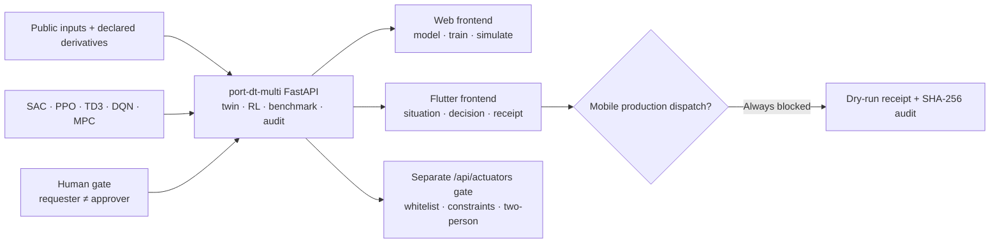
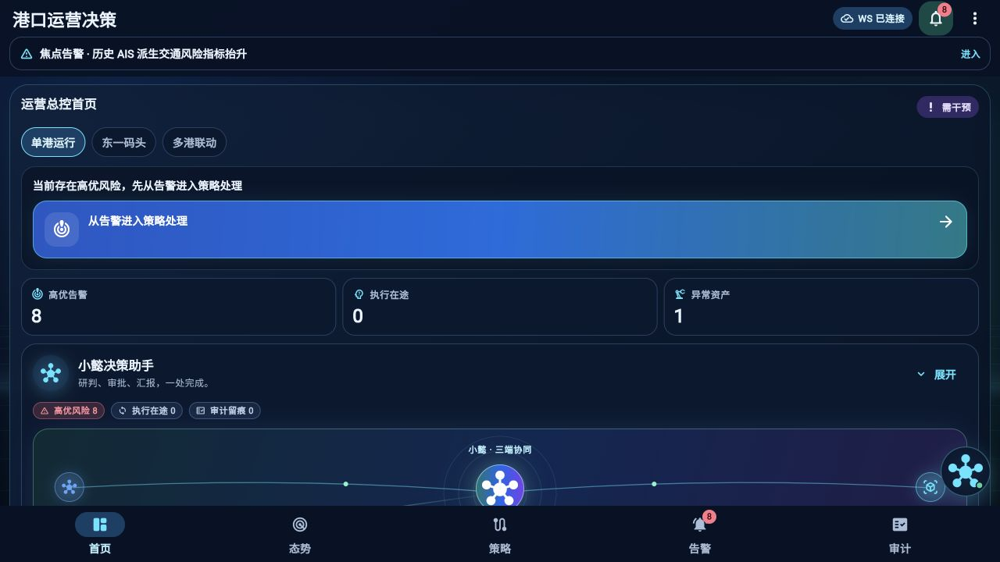
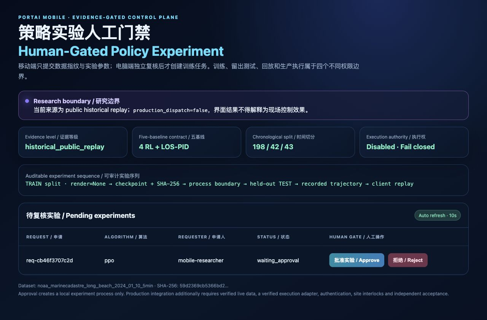

<div align="center">
  

# PortAI DT Mobile

**数字孪生 AI 港口智能决策系统的 Flutter 移动前台**<br>
**The Flutter operations and human-decision frontend of the dual-frontend port digital twin**

[](https://github.com/wenjiayi123/dt-mobile-app/actions/workflows/ci.yml)
[](LICENSE)


[中文](#中文) · [English](#english) · [共享后端契约](docs/SHARED_BACKEND_CONTRACT.md) · [双端简历证据](docs/RESUME_CLAIMS_DUAL_FRONTEND.md) · [安全策略](SECURITY.md)
</div>

---

## 中文

PortAI DT Mobile 是“双端港口智能决策系统”的移动前台，与 Web 前台共同连接
[`port-dt-multi`](https://github.com/wenjiayi123/port-dt-multi) FastAPI。
移动端负责态势查看、风险研判、候选策略对比、人工表态、回执与审计回放；
Web 端负责数字孪生建模、参数配置、训练评测和策略推演。两端读取同一份
业务基准、模型登记和服务端审计证据。

默认运行于 `public_replay`，生产下发关闭。仓库中的 `backend/portai_rl`
保留为独立的公开 AIS 算法实验参考，不是双端系统默认后端，也不用于证明
泊位 +7.45 个百分点 / 待泊 -16.94% / 成本 -11.80% 的系统级业务结果。

### 为什么它不只是一个移动端 Demo

| 层级 | 已实现能力 | 可核验证据 |
|---|---|---|
| 移动数字孪生 | 态势、三维孪生、设备、策略、告警、审计的联动导航 | Flutter 页面、状态控制器与 18 项客户端测试 |
| 双端一致性 | Web / Flutter 读取相同后端身份、KPI报告、候选与回执 | `/api/mobile/status` 与稳定契约 |
| 算法与评测 | SAC、PPO、TD3、DQN 与 MPC；训练不渲染、测试独立 | 共享后端训练器、模型登记、留出集产物 |
| 业务证据 | 52,608 条小时驱动记录、35,064/8,784/8,760 时序切分、2025 全年测试 | 固定业务报告、数据/配置/证据 SHA-256 |
| 人机治理 | 移动申请、电脑端异人审批、幂等表态、服务端回执 | 申请人与审批人分离、原子证据、审计前向链 |
| 移动可靠性 | 500项固定集成操作 | 幂等/越权阻断100%，300条审计事件链通过 |
| 失效安全 | 移动表态不直达设备，南向执行单独受控 | 白名单、约束、异人确认与独立通道 |

### 系统链路



关键边界：`TRAIN render_mode=None → 模型与历史哈希 → 训练进程结束 → held-out TEST → 记录轨迹 → 客户端回放`。

### 真实界面

<table>
  <tr>
    <td width="58%"></td>
    <td width="42%"></td>
  </tr>
  <tr>
    <td><b>移动运营控制面</b><br/>历史 AIS 证据标签、态势入口、小懿决策联动、告警与审计状态。</td>
    <td><b>独立实验审批门禁</b><br/>数据证据、五基线合同、时间切分、执行权与待审批实验同屏复核。</td>
  </tr>
</table>

### 共享后端五算法

| 基线 | 实现 | 动作空间 | 在仓库中的角色 |
|---|---|---|---|
| PPO | Stable-Baselines3 | 连续 | on-policy 策略梯度基线 |
| SAC | Stable-Baselines3 | 连续 | 最大熵 off-policy 基线 |
| TD3 | Stable-Baselines3 | 连续 | 双延迟确定性策略基线 |
| DQN | Stable-Baselines3 | 离散 | 离散策略对照基线 |
| MPC | SciPy 约束优化 | 连续约束 | 滚动时域控制基线 |

短步数 `smoke` 只验证数据、训练、测试和产物接线，不证明收敛、优越性或现场适用性。正式比较必须固定数据哈希、环境版本、种子、预算和评价口径，并保留完整产物。

### 数据与可替换港口契约

双端系统业务基准使用共享后端的 `public_port_ops_v1`：以 MPA 新加坡
2020–2025 官方月度吞吐量和集装箱船到港量为锚点构造 52,608 条小时驱动记录，
按 35,064 train、8,784 validation 和 8,760 test 划分。2025 留出测试相对
“静态 FCFS + 固定能源时刻表”使泊位有效利用率由 83.63% 提升至 91.09%
（+7.45 个百分点），平均待泊时间缩短 16.94%、情景用电成本降低 11.80%。
这些是公开输入驱动的数字孪生结果，不是港口实测 KPI。

本仓库独立实验后端另带一份 NOAA / MarineCadastre 长滩邻近历史 AIS 样本，
只用于算法接线研究；它与上述系统业务指标是两套证据，不混合计算。

接入另一个港口不需要重写算法层：

1. 将源数据映射到 [`port_traffic_timeseries_v1`](docs/DATASET_CONTRACT.md)。
2. 新建 manifest，记录字段映射、来源、数据 SHA-256、证据等级和沙箱响应参数。
3. 设置 `PORTAI_DATASET_MANIFEST=/absolute/path/to/manifest.json`。
4. 通过 `/api/data/status` 核对哈希、范围和时间切分。
5. 数据、环境或奖励合同变化后重新训练；旧模型会被拒绝测试。

[`scripts/import_noaa_ais.py`](scripts/import_noaa_ais.py) 是公开 AIS 转换参考。TOS、ECS、VTS 或现场遥测仍需港口专属适配、标定和独立验收，不能靠字段改名获得生产可信度。

### 快速开始

要求：Flutter `3.38.x` / Dart `3.10.x`，Python `3.12–3.14`。建议使用隔离环境。

```bash
git clone https://github.com/wenjiayi123/port-dt-multi.git
cd port-dt-multi
python3.12 -m venv .venv
source .venv/bin/activate
python -m pip install -r requirements.txt
python -m uvicorn app.server:app --host 127.0.0.1 --port 8000
```

另开终端启动 Flutter：

```bash
git clone https://github.com/wenjiayi123/dt-mobile-app.git
cd dt-mobile-app
flutter pub get
flutter run -d chrome \
  --dart-define=API_BASE_URL=http://127.0.0.1:8000 \
  --dart-define=APP_ENV=public_replay
```

在“策略”页选择基线和实验预算，提交申请；电脑端打开 `http://127.0.0.1:8000/rl-panel`，由不同操作者批准后才创建本地实验进程。

Docker 方式：

```bash
docker compose up --build
```

### 验证门禁

指标、测试与双端共享证据的对应关系见
[`docs/EVIDENCE_INDEX.md`](docs/EVIDENCE_INDEX.md)。

```bash
# Flutter：格式、静态分析与测试
bash scripts/check.sh

# Python：编译与 API / 训练合同测试
python3.12 -m venv backend/.venv
backend/.venv/bin/python -m pip install -r backend/requirements.txt
bash scripts/check_backend.sh

# 五基线 128 步接线验证；smoke_only=true
backend/.venv/bin/python scripts/smoke_all_baselines.py --timesteps 128

# 上述门禁 + 数据边界与禁用伪造指标检查
bash scripts/release_check.sh
```

当前移动端基线：Flutter analyze 通过，18项客户端测试通过。共享后端另验证
SAC / PPO / TD3 / DQN / MPC 与500项移动闭环操作；独立 AIS 实验后端的
短步数 smoke 仅保留为算法接线证据。

### 生产门禁与安全边界

默认 `production_dispatch_enabled=false`。生产适配至少要求：

- `PORTAI_DATA_MODE=live` 与经过验证的实时数据网关；
- `PORTAI_LIVE_DATA_VERIFIED=true`；
- `PORTAI_EXECUTION_ADAPTER_VERIFIED=true` 与专属执行适配器；
- 32 字符以上 API 密钥、严格 CORS、站点联锁、最小权限凭证与独立验收。

任一条件缺失都只写入 dry-run 审计，不会下发现场动作。本仓库不是经认证的船舶导航、避碰、VTS、监管执法或自动驾驶系统，不应直接用于真实船舶决策。

### 仓库结构

```text
lib/                         Flutter 移动控制面、状态与数据源
backend/portai_rl/           可选的独立 AIS 实验参考（非系统默认后端）
backend/config/              可审计数据 manifest
backend/data/                去标识化公开 AIS 聚合样本
scripts/                     启动、导入、测试与发布门禁
test/                        Flutter 合同和界面测试
backend/tests/               API、隔离、哈希和安全边界测试
docs/                        方法、数据、接口、演示和安全文档
```

---

## English

PortAI DT Mobile is the Flutter frontend of the dual-frontend port decision
system. It connects to the same `port-dt-multi` FastAPI service as the Web
frontend for system identity, business evidence, registered policy candidates,
human decisions, receipts, and audit verification. The bundled AIS experiment
backend is an optional standalone research reference, not the default system
backend.

It is deliberately not presented as a production port controller. The default dataset is an aggregated historical replay derived from public NOAA / MarineCadastre AIS. Environment action responses are declared sandbox assumptions, and production dispatch fails closed unless independently verified live-data and execution-adapter gates are both enabled.

### What is implemented

- **Linked operational surfaces:** situation, 3D twin, equipment, risk, scheduling, policy, alerts, evidence replay, audit, and Xiaoyi-assisted navigation share application state rather than existing as isolated mock screens.
- **Governed data contract:** source locator, bounding box, time range, de-identification statement, field mapping, schema version, and SHA-256 are carried in the dataset manifest.
- **Shared five-controller contract:** SAC, PPO, TD3, DQN, and constrained MPC are owned by the Web backend.
- **Evaluation isolation:** chronological 70/15/15 splits, train-only normalization, a process boundary after training, and test-only recorded trajectories prevent the client from presenting training animation as evaluation evidence.
- **Artifact lineage:** policy, training history, dataset, environment, and rollout identifiers are retained for replay and review.
- **Human-gated execution:** mobile requests do not start a job until a different desktop operator approves them. Request size, identifiers, concurrency, parameters, credentials, and production gates are bounded or validated.
- **Tamper-evident audit:** server-side JSONL records use a SHA-256 forward chain. This provides tamper evidence, not an external timestamp or immutable ledger.

### Reproducible research sequence

```text
public inputs + declared engineering derivatives
  → shared backend dataset and evidence hashes
  → chronological TRAIN / VALIDATION / TEST split
  → headless SAC / PPO / TD3 / DQN or constrained MPC
  → separate held-out evaluation
  → registered candidate + human decision
  → idempotent receipt + SHA-256 audit chain
  → evidence-labelled Flutter presentation
```

The bundled example contains 283 five-minute intervals split into 198 train, 42 validation, and 43 held-out test rows. Validation is preserved as a separate temporal segment; it is not silently merged into training. See [RL methodology](docs/RL_METHODOLOGY.md) for the exact contract and limitations.

### Run, test, and extend

Use the commands in [Quick start](#快速开始), then consult:

- [Dataset contract](docs/DATASET_CONTRACT.md) for port substitution;
- [Backend contract](docs/BACKEND_CONTRACT.md) for API and WebSocket semantics;
- [RL methodology](docs/RL_METHODOLOGY.md) for train/test separation;
- [Data sources](docs/DATA_SOURCES.md) for provenance and permitted interpretation;
- [Testing](docs/TESTING.md) for verification scope;
- [Security policy](SECURITY.md) for deployment gates and reporting;
- [Contributing](CONTRIBUTING.md) and [governance](GOVERNANCE.md) for project workflow.

### Scope statement

This repository is a research, teaching, and software-verification project. It does not claim policy convergence, superiority over established control, real-time telemetry coverage, production dispatch authority, regulatory suitability, or navigational certification. Any deployment involving real port or vessel operations requires site-specific data agreements, calibration, safety engineering, authenticated adapters, interlocks, independent acceptance, and accountable human authority.

## License and data terms

Code is released under the [MIT License](LICENSE). Dataset provenance and limitations are documented separately in [docs/DATA_SOURCES.md](docs/DATA_SOURCES.md); the software license does not override source-data terms or grant operational approval.

If you use the architecture or experiment contract in academic work, see [`CITATION.cff`](CITATION.cff).
